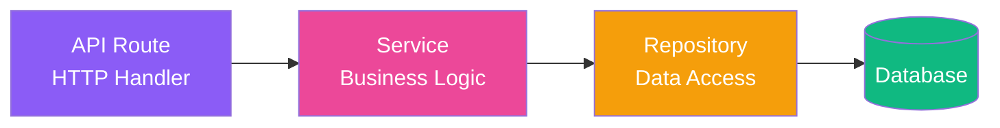

# Backend Architecture

TamborraData's backend implements a clean **three-layer architecture**: API Routes → Services → Repositories. This pattern provides clear separation between HTTP handling, business logic, and data access.

## Layered Pattern



<Info>
  **Key Principle:** Each layer has a single responsibility and depends only on the layer below it.
</Info>

## API Route Layer

**Location:** `app/(backend)/api/*/route.ts`

**Responsibilities:**
- Handle HTTP requests/responses
- Parse query parameters
- Validate inputs using DTOs
- Call services
- Format responses
- Handle errors

<Tabs>
  <Tab title="Statistics Route">
    ```typescript
    // app/(backend)/api/statistics/route.ts
    import 'server-only';
    import { NextResponse } from 'next/server';
    import { getStatistics } from './services/statistics.service';
    import { getSysStatus } from '../../shared/utils/getSysStatus';
    import { checkParams } from './dtos/statistics.schema';

    export async function GET(req: Request) {
      try {
        const year = new URL(req.url).searchParams.get('year');

        // 1. Validate parameters
        const { valid, cleanYear, error: paramError } = await checkParams(year);
        
        if (!valid) {
          return NextResponse.json({ error: paramError }, { status: 404 });
        }

        // 2. Check system status
        const isUpdating: boolean = await getSysStatus();
        
        if (isUpdating) {
          return NextResponse.json({ isUpdating: true }, { status: 200 });
        }

        // 3. Call service
        const { statistics, error } = await getStatistics(cleanYear);

        if (error && !statistics) {
          return NextResponse.json({ error }, { status: 500 });
        }

        // 4. Format response
        return NextResponse.json({
          isUpdating,
          year: cleanYear,
          total_categories: statistics ? Object.keys(statistics).length : 0,
          statistics,
        });
      } catch (error) {
        return NextResponse.json(
          { error: 'Error al obtener el estado del sistema', details: error },
          { status: 500 }
        );
      }
    }
    ```
  </Tab>
  
  <Tab title="Participants Route">
    ```typescript
    // app/(backend)/api/participants/route.ts
    import 'server-only';
    import { NextResponse } from 'next/server';
    import { checkParams } from './dtos/participants.schema';
    import { getParticipants } from './services/participants.service';

    export async function GET(req: Request) {
      try {
        const { searchParams } = new URL(req.url);
        const name = searchParams.get('name');
        const company = searchParams.get('company');

        // 1. Validate parameters
        const { valid, cleanName, error: paramError } = 
          await checkParams(name, company);

        if (!valid) {
          return NextResponse.json({ error: paramError }, { status: 400 });
        }

        // 2. Call service
        const { participants, error: serviceError } = 
          await getParticipants(cleanName, company);

        if (serviceError && !participants) {
          return NextResponse.json({ error: serviceError }, { status: 500 });
        }

        // 3. Format response
        return NextResponse.json({ participants });
      } catch (error) {
        return NextResponse.json(
          { error: 'Error al obtener participantes', details: error },
          { status: 500 }
        );
      }
    }
    ```
  </Tab>
</Tabs>

<Warning>
  **Route handlers should NOT:**
  - Contain business logic
  - Execute database queries
  - Transform data (beyond formatting responses)
  - Have complex conditionals
</Warning>

## Service Layer

**Location:** `app/(backend)/api/*/services/*.service.ts`

**Responsibilities:**
- Implement business logic
- Orchestrate repository calls
- Transform and format data
- Handle errors and logging
- Apply business rules

<Tabs>
  <Tab title="Statistics Service">
    ```typescript
    // app/(backend)/api/statistics/services/statistics.service.ts
    import 'server-only';
    import { log } from '@/app/(backend)/core/logger';
    import { fetchStatistics } from '../repositories/statistics.repo';
    import { groupBy } from '@/app/(backend)/shared/utils/groupBy';
    import { StatisticsType } from '../types';

    export async function getStatistics(year: string): Promise<StatisticsType> {
      // 1. Fetch data from repository
      const { statistics, error } = await fetchStatistics(year);

      if (error && !statistics) {
        log(`getStatistics error for year ${year}: ${error}`, 'error');
        return { statistics: null, error };
      }

      // 2. Apply business logic: group by category
      const statsByCategory = groupBy(statistics, 'category');

      // 3. Return formatted data
      return { statistics: statsByCategory, error: null };
    }
    ```
  </Tab>
  
  <Tab title="Participants Service">
    ```typescript
    // app/(backend)/api/participants/services/participants.service.ts
    import 'server-only';
    import { log } from '@/app/(backend)/core/logger';
    import { fetchParticipants } from '../repositories/participants.repo';
    import { ParticipantsType } from '../types';

    export async function getParticipants(
      name: string,
      company?: string
    ): Promise<ParticipantsType> {
      try {
        // 1. Fetch from repository
        const { participants, error } = await fetchParticipants(name, company);

        if (error && !participants) {
          log(`getParticipants error: ${error}`, 'error');
          return { participants: null, error };
        }

        // 2. Apply business logic (filtering, sorting, etc.)
        const sortedParticipants = participants?.sort((a, b) => 
          b.year.localeCompare(a.year)
        );

        return { participants: sortedParticipants, error: null };
      } catch (err) {
        log(`getParticipants unexpected error: ${err}`, 'error');
        return { 
          participants: null, 
          error: 'Error inesperado al obtener participantes' 
        };
      }
    }
    ```
  </Tab>
</Tabs>

<Note>
  **Services are the "brain" of the application.** They contain all business logic and decision-making code.
</Note>

## Repository Layer

**Location:** `app/(backend)/api/*/repositories/*.repo.ts`

**Responsibilities:**
- Execute database queries
- Abstract data access
- Handle database errors
- Return raw data

<Tabs>
  <Tab title="Statistics Repository">
    ```typescript
    // app/(backend)/api/statistics/repositories/statistics.repo.ts
    import 'server-only';
    import { log } from '@/app/(backend)/core/logger';
    import { supabaseClient } from '@/app/(backend)/core/db/supabaseClient';
    import { FetchStatisticsType } from '../types';

    export async function fetchStatistics(
      year: string
    ): Promise<FetchStatisticsType> {
      try {
        // Execute Supabase query
        const { data, error } = await supabaseClient
          .from('statistics')
          .select('category, public_data, summary')
          .eq('year', year)
          .order('public_data', { ascending: false })
          .limit(30);

        if (error) {
          log(`Error fetching statistics for year ${year}: ${error.message}`, 'error');
          return { statistics: null, error: 'Error de la base de datos' };
        }

        return { statistics: data ?? null, error: null };
      } catch (error) {
        log(`Error fetching statistics for year ${year}: ${JSON.stringify(error)}`, 'error');
        return { 
          statistics: null, 
          error: 'Error inesperado, por favor intente nuevamente más tarde' 
        };
      }
    }
    ```
  </Tab>
  
  <Tab title="Participants Repository">
    ```typescript
    // app/(backend)/api/participants/repositories/participants.repo.ts
    import 'server-only';
    import { log } from '@/app/(backend)/core/logger';
    import { supabaseClient } from '@/app/(backend)/core/db/supabaseClient';
    import { FetchParticipantsType } from '../types';

    export async function fetchParticipants(
      name: string,
      company?: string
    ): Promise<FetchParticipantsType> {
      try {
        // Build query
        let query = supabaseClient
          .from('participants')
          .select('name, company, year, category')
          .ilike('name', `%${name}%`);

        // Apply optional filter
        if (company) {
          query = query.eq('company', company);
        }

        // Execute query
        const { data, error } = await query.limit(100);

        if (error) {
          log(`Error fetching participants: ${error.message}`, 'error');
          return { participants: null, error: 'Error de la base de datos' };
        }

        return { participants: data ?? null, error: null };
      } catch (error) {
        log(`Error fetching participants: ${JSON.stringify(error)}`, 'error');
        return { 
          participants: null, 
          error: 'Error inesperado' 
        };
      }
    }
    ```
  </Tab>
  
  <Tab title="Years Repository">
    ```typescript
    // app/(backend)/api/years/repositories/years.repo.ts
    import 'server-only';
    import { log } from '@/app/(backend)/core/logger';
    import { supabaseClient } from '@/app/(backend)/core/db/supabaseClient';
    import { FetchYearsType } from '../types';

    export async function fetchYears(): Promise<FetchYearsType> {
      try {
        const { data, error } = await supabaseClient
          .from('available_years')
          .select('year, is_ready')
          .eq('is_ready', true)
          .order('year', { ascending: false });

        if (error) {
          log(`Error fetching years: ${error.message}`, 'error');
          return { years: null, error: 'Error de la base de datos' };
        }

        return { years: data ?? null, error: null };
      } catch (error) {
        log(`Error fetching years: ${JSON.stringify(error)}`, 'error');
        return { years: null, error: 'Error inesperado' };
      }
    }
    ```
  </Tab>
</Tabs>

<Warning>
  **Repositories should NOT:**
  - Contain business logic
  - Transform data (return raw database results)
  - Call other repositories
  - Make decisions based on data
</Warning>

## DTO (Data Transfer Object) Layer

**Location:** `app/(backend)/api/*/dtos/*.schema.ts`

**Responsibilities:**
- Validate request parameters
- Sanitize inputs
- Return validation results

<Tabs>
  <Tab title="Statistics DTO">
    ```typescript
    // app/(backend)/api/statistics/dtos/statistics.schema.ts
    import 'server-only';
    import { VALID_YEARS } from '@/app/(backend)/shared/constants/catalog';
    import { CheckParamsType } from '../types';

    export async function checkParams(
      year: string
    ): Promise<CheckParamsType> {
      // Check if year parameter exists
      if (!year) {
        return { 
          valid: false, 
          cleanYear: null, 
          error: "El parámetro 'year' es obligatorio" 
        };
      }

      // Clean whitespace
      const cleanYear = year.trim();

      // Validate format
      if (cleanYear !== 'global' && !/^\d{4}$/.test(cleanYear)) {
        return {
          valid: false,
          cleanYear: null,
          error: "El parámetro 'year' debe ser 'global' o un año válido de cuatro dígitos",
        };
      }

      // Validate against available years
      const validYears: string[] = await VALID_YEARS();
      if (!validYears.includes(year)) {
        return {
          valid: false,
          cleanYear: null,
          error: `Año inválido. Años válidos: ${validYears.slice(0, 4).join(', ')}, ...`,
        };
      }

      return { valid: true, cleanYear, error: null };
    }
    ```
  </Tab>
  
  <Tab title="Participants DTO">
    ```typescript
    // app/(backend)/api/participants/dtos/participants.schema.ts
    import 'server-only';
    import { CheckParamsType } from '../types';

    export async function checkParams(
      name: string | null,
      company?: string | null
    ): Promise<CheckParamsType> {
      // Validate required parameter
      if (!name) {
        return {
          valid: false,
          cleanName: null,
          error: "El parámetro 'name' es obligatorio",
        };
      }

      // Sanitize input
      const cleanName = name.trim();

      // Validate minimum length
      if (cleanName.length < 3) {
        return {
          valid: false,
          cleanName: null,
          error: 'El nombre debe tener al menos 3 caracteres',
        };
      }

      // Validate name contains only letters and spaces
      if (!/^[a-zA-ZáéíóúÁÉÍÓÚñÑ\s]+$/.test(cleanName)) {
        return {
          valid: false,
          cleanName: null,
          error: 'El nombre solo puede contener letras y espacios',
        };
      }

      return { valid: true, cleanName, error: null };
    }
    ```
  </Tab>
</Tabs>

<Info>
  **DTOs prevent SQL injection and validate business rules** before data reaches the service layer.
</Info>

## Feature Structure

Each API feature follows this consistent structure:

```
app/(backend)/api/[feature]/
├── route.ts                    # HTTP handler (GET/POST/PUT/DELETE)
├── services/
│   └── [feature].service.ts    # Business logic
├── repositories/
│   └── [feature].repo.ts       # Data access
├── dtos/
│   └── [feature].schema.ts     # Validation
└── types/
    └── index.ts                # TypeScript types
```

### Real Examples

<Tabs>
  <Tab title="Statistics">
    ```
    api/statistics/
    ├── route.ts
    ├── services/
    │   └── statistics.service.ts
    ├── repositories/
    │   └── statistics.repo.ts
    ├── dtos/
    │   └── statistics.schema.ts
    └── types/
        └── index.ts
    ```
  </Tab>
  
  <Tab title="Participants">
    ```
    api/participants/
    ├── route.ts
    ├── services/
    │   └── participants.service.ts
    ├── repositories/
    │   └── participants.repo.ts
    ├── dtos/
    │   └── participants.schema.ts
    └── types/
        └── index.ts
    ```
  </Tab>
  
  <Tab title="Years">
    ```
    api/years/
    ├── route.ts
    ├── services/
    │   └── years.service.ts
    ├── repositories/
    │   └── years.repo.ts
    └── types/
        └── index.ts
    ```
  </Tab>
  
  <Tab title="Companies">
    ```
    api/companies/
    ├── route.ts
    ├── services/
    │   └── companies.service.ts
    ├── repositories/
    │   └── companies.repo.ts
    └── types/
        └── index.ts
    ```
  </Tab>
</Tabs>

## Shared Utilities

**Location:** `app/(backend)/shared/`

Shared utilities used across features:

```
shared/
├── utils/
│   ├── groupBy.ts              # Group array by key
│   └── getSysStatus.ts         # Get system status
└── constants/
    └── catalog.ts              # Shared constants
```

<Tabs>
  <Tab title="groupBy Utility">
    ```typescript
    // shared/utils/groupBy.ts
    export function groupBy<T>(array: T[], key: keyof T): Record<string, T[]> {
      return array.reduce((result, item) => {
        const groupKey = String(item[key]);
        if (!result[groupKey]) {
          result[groupKey] = [];
        }
        result[groupKey].push(item);
        return result;
      }, {} as Record<string, T[]>);
    }
    ```
  </Tab>
  
  <Tab title="getSysStatus Utility">
    ```typescript
    // shared/utils/getSysStatus.ts
    import { supabaseClient } from '@/app/(backend)/core/db/supabaseClient';

    export async function getSysStatus(): Promise<boolean> {
      try {
        const { data, error } = await supabaseClient
          .from('sys_status')
          .select('is_updating')
          .eq('id', 1)
          .single();

        if (error) {
          return false;
        }

        return data?.is_updating ?? false;
      } catch (error) {
        return false;
      }
    }
    ```
  </Tab>
</Tabs>

## Database Client

**Location:** `app/(backend)/core/db/supabaseClient.ts`

```typescript
import 'server-only';
import 'dotenv/config';
import { createClient } from '@supabase/supabase-js';

// Supabase configuration
const supabaseUrl = process.env.SUPABASE_URL!;
const supabaseAnonKey = process.env.SUPABASE_ANON_KEY!;

export const supabaseClient = createClient(supabaseUrl, supabaseAnonKey);
```

<Note>
  The `'server-only'` import ensures this code never runs on the client side.
</Note>

## Error Handling

Consistent error handling across all layers:

<Tabs>
  <Tab title="Repository Level">
    ```typescript
    try {
      const { data, error } = await supabaseClient
        .from('table')
        .select('*');

      if (error) {
        log(`Database error: ${error.message}`, 'error');
        return { data: null, error: 'Error de la base de datos' };
      }

      return { data, error: null };
    } catch (error) {
      log(`Unexpected error: ${error}`, 'error');
      return { data: null, error: 'Error inesperado' };
    }
    ```
  </Tab>
  
  <Tab title="Service Level">
    ```typescript
    const { data, error } = await repository.fetch();

    if (error && !data) {
      log(`Service error: ${error}`, 'error');
      return { result: null, error };
    }

    // Apply business logic
    const processed = processData(data);

    return { result: processed, error: null };
    ```
  </Tab>
  
  <Tab title="Route Level">
    ```typescript
    try {
      const { result, error } = await service.get();

      if (error && !result) {
        return NextResponse.json(
          { error }, 
          { status: 500 }
        );
      }

      return NextResponse.json({ result });
    } catch (error) {
      return NextResponse.json(
        { error: 'Internal server error' },
        { status: 500 }
      );
    }
    ```
  </Tab>
</Tabs>

## Testing Strategy

<AccordionGroup>
  <Accordion title="Unit Tests" icon="vial">
    **Test each layer independently:**
    
    ```typescript
    // Service test with mocked repository
    describe('getStatistics', () => {
      it('should group statistics by category', async () => {
        const mockRepo = {
          fetchStatistics: jest.fn().mockResolvedValue({
            statistics: mockData,
            error: null,
          }),
        };

        const result = await getStatistics('2024');
        
        expect(result.statistics).toHaveProperty('top-names');
        expect(result.error).toBeNull();
      });
    });
    ```
  </Accordion>

  <Accordion title="Integration Tests" icon="puzzle-piece">
    **Test layer interactions:**
    
    ```typescript
    // API route integration test
    describe('GET /api/statistics', () => {
      it('should return statistics for valid year', async () => {
        const response = await fetch('/api/statistics?year=2024');
        const data = await response.json();

        expect(response.status).toBe(200);
        expect(data).toHaveProperty('statistics');
        expect(data.year).toBe('2024');
      });
    });
    ```
  </Accordion>

  <Accordion title="E2E Tests" icon="robot">
    **Test complete flows:**
    
    ```typescript
    // End-to-end test with real database
    describe('Statistics flow', () => {
      it('should fetch and display statistics', async () => {
        await page.goto('/statistics/2024');
        
        await page.waitForSelector('[data-testid="stats-table"]');
        
        const table = await page.$('[data-testid="stats-table"]');
        expect(table).toBeTruthy();
      });
    });
    ```
  </Accordion>
</AccordionGroup>

## Benefits of Repository Pattern

<CardGroup cols={2}>
  <Card title="Abstraction" icon="cube">
    Repositories abstract database implementation. Switching from Supabase to another database only requires changing repositories.
  </Card>
  
  <Card title="Testability" icon="flask">
    Services can be tested by mocking repositories, without needing a real database.
  </Card>
  
  <Card title="Reusability" icon="recycle">
    Same repository can be used by multiple services, avoiding code duplication.
  </Card>
  
  <Card title="Maintainability" icon="wrench">
    Clear separation makes it easy to find and modify code. Changes in one layer don't affect others.
  </Card>
</CardGroup>

## Next Steps

<CardGroup cols={2}>
  <Card title="Frontend" icon="react" href="./frontend">
    Learn about Server Components and React Query
  </Card>
  <Card title="Database" icon="database" href="./database">
    Explore PostgreSQL schema and RLS policies
  </Card>
</CardGroup>