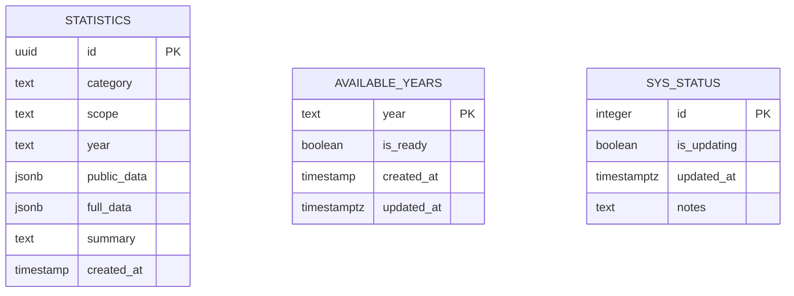

# Database Architecture

TamborraData uses **Supabase PostgreSQL** with **Row Level Security (RLS)** to ensure data protection at the database level. The application is read-only from the web interface, with write access reserved for the data pipeline.

## Database Stack

<CardGroup cols={3}>
  <Card title="PostgreSQL" icon="elephant">
    Relational database with JSONB support
  </Card>
  <Card title="Supabase" icon="fire">
    Managed PostgreSQL with built-in RLS
  </Card>
  <Card title="Row Level Security" icon="shield">
    Database-enforced access control
  </Card>
</CardGroup>

## Database Schema

The database consists of three main tables:

### Schema Diagram



### Table Details

<Tabs>
  <Tab title="statistics">
    **Purpose:** Stores all statistical data aggregated by category, scope, and year.
    
    ```sql
    CREATE TABLE statistics (
      id uuid PRIMARY KEY DEFAULT gen_random_uuid(),
      category text NOT NULL,
      scope text NOT NULL,
      year text NOT NULL,
      public_data jsonb,
      full_data jsonb,
      summary text,
      created_at timestamp DEFAULT now() NOT NULL,
      UNIQUE (category, scope, year)
    );
    ```
    
    **Columns:**
    - `id`: Primary key (UUID)
    - `category`: Type of statistic (e.g., "top-names", "top-schools")
    - `scope`: Data scope ("year" or "global")
    - `year`: Year or "global" for aggregated data
    - `public_data`: Public-facing data (JSONB for flexibility)
    - `full_data`: Complete data (includes sensitive info)
    - `summary`: Human-readable description
    - `created_at`: Creation timestamp
    
    **Unique Constraint:** `(category, scope, year)` ensures no duplicates
    
    <Note>
      **JSONB columns** allow flexible schema while maintaining queryability. PostgreSQL can index and query JSONB efficiently.
    </Note>
  </Tab>
  
  <Tab title="available_years">
    **Purpose:** Tracks which years have complete data ready for display.
    
    ```sql
    CREATE TABLE available_years (
      year text UNIQUE PRIMARY KEY,
      is_ready boolean DEFAULT FALSE NOT NULL,
      created_at timestamp DEFAULT now() NOT NULL,
      updated_at timestamptz DEFAULT now() NOT NULL
    );
    ```
    
    **Columns:**
    - `year`: Year identifier (e.g., "2024", "global")
    - `is_ready`: Whether data is complete and ready
    - `created_at`: When year was added
    - `updated_at`: Last modification timestamp
    
    **Usage:**
    ```typescript
    // Frontend queries only ready years
    SELECT year FROM available_years WHERE is_ready = true;
    ```
  </Tab>
  
  <Tab title="sys_status">
    **Purpose:** Global system status flag for coordinating updates.
    
    ```sql
    CREATE TABLE sys_status (
      id integer PRIMARY KEY DEFAULT 1,
      is_updating boolean DEFAULT FALSE NOT NULL,
      updated_at timestamptz DEFAULT now() NOT NULL,
      notes text
    );
    ```
    
    **Columns:**
    - `id`: Always 1 (singleton pattern)
    - `is_updating`: Whether data pipeline is running
    - `updated_at`: Last status change
    - `notes`: Optional status message
    
    **Singleton Pattern:**
    ```sql
    -- Only one row ever exists
    INSERT INTO sys_status (id, is_updating, notes)
    VALUES (1, false, 'Sistema iniciado')
    ON CONFLICT (id) DO NOTHING;
    ```
    
    <Info>
      This table prevents the frontend from showing stale data during pipeline updates.
    </Info>
  </Tab>
</Tabs>

## Row Level Security (RLS)

TamborraData implements **defense in depth** with database-enforced access control:

### Enable RLS

```sql
-- Enable RLS on all tables
ALTER TABLE statistics ENABLE ROW LEVEL SECURITY;
ALTER TABLE available_years ENABLE ROW LEVEL SECURITY;
ALTER TABLE sys_status ENABLE ROW LEVEL SECURITY;
```

### RLS Policies

<Tabs>
  <Tab title="Read-Only for Anonymous">
    ```sql
    -- Anonymous users (web app) can only read
    CREATE POLICY "Anon read access on statistics"
    ON statistics
    FOR SELECT
    TO anon
    USING (true);

    CREATE POLICY "Anon read access on available_years"
    ON available_years
    FOR SELECT
    TO anon
    USING (true);

    CREATE POLICY "Anon read access on sys_status"
    ON sys_status
    FOR SELECT
    TO anon
    USING (true);
    ```
    
    <Note>
      `USING (true)` means all rows are visible, but **only for SELECT**. INSERT, UPDATE, DELETE are denied by default.
    </Note>
  </Tab>
  
  <Tab title="Write Access (Pipeline)">
    Write access is granted to the service role (used by data pipeline):
    
    ```sql
    -- Service role has full access
    -- (Implicit: service_role bypasses RLS by default)
    
    -- Pipeline uses SUPABASE_SERVICE_ROLE_KEY
    -- Web app uses SUPABASE_ANON_KEY
    ```
    
    **Environment separation:**
    ```bash
    # Web app (.env)
    SUPABASE_ANON_KEY=eyJ...    # Read-only
    
    # Pipeline (.env)
    SUPABASE_SERVICE_KEY=eyJ... # Read-write
    ```
  </Tab>
  
  <Tab title="Security Benefits">
    <AccordionGroup>
      <Accordion title="Defense in Depth" icon="shield">
        Even if API is compromised, database enforces read-only access. Attackers cannot modify data.
      </Accordion>
      
      <Accordion title="No Application Logic" icon="code">
        Security enforced by PostgreSQL, not application code. Cannot be bypassed.
      </Accordion>
      
      <Accordion title="Audit Trail" icon="list">
        All access attempts logged by PostgreSQL. Can track unauthorized access.
      </Accordion>
      
      <Accordion title="Performance" icon="bolt">
        PostgreSQL optimizes queries with RLS natively. No performance penalty.
      </Accordion>
    </AccordionGroup>
  </Tab>
</Tabs>

### RLS vs API Middleware

| Aspect | API Middleware | Row Level Security |
|--------|----------------|--------------------|
| **Enforcement** | Application layer | Database layer |
| **Bypassable** | ✅ Yes (if API compromised) | ❌ No (database-enforced) |
| **Performance** | ⚠️ Additional app logic | ✅ Native PostgreSQL |
| **Maintainability** | ❌ Duplicate in multiple APIs | ✅ Single source of truth |
| **Auditing** | ⚠️ Application logs | ✅ Database logs |
| **Testing** | ❌ Must test in each API | ✅ Test once at DB level |

<Warning>
  **RLS is the last line of defense.** Even if your API routes are compromised, RLS ensures data cannot be modified.
</Warning>

## Data Access Patterns

### Repository Queries

All database access goes through repositories:

<Tabs>
  <Tab title="Fetch Statistics">
    ```typescript
    // app/(backend)/api/statistics/repositories/statistics.repo.ts
    export async function fetchStatistics(year: string) {
      const { data, error } = await supabaseClient
        .from('statistics')
        .select('category, public_data, summary')
        .eq('year', year)
        .order('public_data', { ascending: false })
        .limit(30);

      if (error) {
        return { statistics: null, error: 'Error de la base de datos' };
      }

      return { statistics: data, error: null };
    }
    ```
    
    **Query breakdown:**
    1. Select only needed columns (not `full_data`)
    2. Filter by year
    3. Order by data (JSONB ordering)
    4. Limit results for performance
  </Tab>
  
  <Tab title="Fetch Available Years">
    ```typescript
    // app/(backend)/api/years/repositories/years.repo.ts
    export async function fetchYears() {
      const { data, error } = await supabaseClient
        .from('available_years')
        .select('year, is_ready')
        .eq('is_ready', true)
        .order('year', { ascending: false });

      if (error) {
        return { years: null, error: 'Error de la base de datos' };
      }

      return { years: data, error: null };
    }
    ```
    
    **Query breakdown:**
    1. Select year and ready status
    2. Filter for ready years only
    3. Order descending (newest first)
  </Tab>
  
  <Tab title="Check System Status">
    ```typescript
    // app/(backend)/shared/utils/getSysStatus.ts
    export async function getSysStatus(): Promise<boolean> {
      const { data, error } = await supabaseClient
        .from('sys_status')
        .select('is_updating')
        .eq('id', 1)
        .single();

      if (error) return false;

      return data?.is_updating ?? false;
    }
    ```
    
    **Query breakdown:**
    1. Select only `is_updating` column
    2. Get singleton row (id=1)
    3. Use `.single()` to return object, not array
  </Tab>
</Tabs>

## JSONB Data Structure

TamborraData uses JSONB for flexible statistical data:

### Example Data

<Tabs>
  <Tab title="Statistics Row">
    ```json
    {
      "id": "550e8400-e29b-41d4-a716-446655440000",
      "category": "top-names",
      "scope": "year",
      "year": "2024",
      "public_data": [
        {
          "rank": 1,
          "name": "Juan",
          "count": 245,
          "percentage": 8.5
        },
        {
          "rank": 2,
          "name": "María",
          "count": 230,
          "percentage": 8.0
        }
      ],
      "summary": "Top 10 most common names in 2024",
      "created_at": "2024-11-07T18:14:24.891472Z"
    }
    ```
  </Tab>
  
  <Tab title="Querying JSONB">
    ```sql
    -- Query JSONB fields
    SELECT 
      category,
      public_data->0->>'name' as top_name,
      public_data->0->>'count' as count
    FROM statistics
    WHERE year = '2024'
      AND category = 'top-names';

    -- Filter by JSONB content
    SELECT *
    FROM statistics
    WHERE public_data @> '[{"name": "Juan"}]';

    -- Get array length
    SELECT 
      category,
      jsonb_array_length(public_data) as item_count
    FROM statistics;
    ```
  </Tab>
  
  <Tab title="JSONB Benefits">
    <CardGroup cols={2}>
      <Card title="Flexible Schema" icon="arrows-spin">
        Different categories can have different data structures without schema changes.
      </Card>
      
      <Card title="Queryable" icon="magnifying-glass">
        PostgreSQL can index and query JSONB efficiently with GIN indexes.
      </Card>
      
      <Card title="Type Safe" icon="check">
        JSONB validates JSON on insert, rejecting invalid data.
      </Card>
      
      <Card title="Performance" icon="bolt">
        Binary format is faster than text JSON. GIN indexes speed up queries.
      </Card>
    </CardGroup>
  </Tab>
</Tabs>

## Indexing Strategy

<Info>
  **Indexes improve query performance** by allowing PostgreSQL to find rows without scanning entire tables.
</Info>

### Recommended Indexes

```sql
-- Composite index for common query pattern
CREATE INDEX idx_statistics_year_category 
ON statistics (year, category);

-- Index on is_ready for filtering
CREATE INDEX idx_years_ready 
ON available_years (is_ready) 
WHERE is_ready = true;

-- GIN index for JSONB queries
CREATE INDEX idx_statistics_public_data 
ON statistics USING GIN (public_data);

-- Index on created_at for time-based queries
CREATE INDEX idx_statistics_created 
ON statistics (created_at DESC);
```

### Index Usage Examples

<Tabs>
  <Tab title="Composite Index">
    ```sql
    -- Uses idx_statistics_year_category
    SELECT * 
    FROM statistics 
    WHERE year = '2024' 
      AND category = 'top-names';
    
    -- Index covers both conditions efficiently
    ```
  </Tab>
  
  <Tab title="GIN Index">
    ```sql
    -- Uses idx_statistics_public_data
    SELECT * 
    FROM statistics 
    WHERE public_data @> '{"rank": 1}';
    
    -- GIN index enables fast JSONB containment queries
    ```
  </Tab>
  
  <Tab title="Explain Query">
    ```sql
    -- Check if index is used
    EXPLAIN ANALYZE
    SELECT * 
    FROM statistics 
    WHERE year = '2024';
    
    -- Output shows "Index Scan using idx_statistics_year_category"
    ```
  </Tab>
</Tabs>

## Connection Management

Supabase handles connection pooling automatically:

```typescript
// app/(backend)/core/db/supabaseClient.ts
import 'server-only';
import { createClient } from '@supabase/supabase-js';

const supabaseUrl = process.env.SUPABASE_URL!;
const supabaseAnonKey = process.env.SUPABASE_ANON_KEY!;

export const supabaseClient = createClient(supabaseUrl, supabaseAnonKey);
```

<Note>
  **Connection pooling** is handled by Supabase's infrastructure. The client automatically manages connections, retries, and timeouts.
</Note>

### Environment Variables

```bash
# .env.local
SUPABASE_URL=https://xxxxx.supabase.co
SUPABASE_ANON_KEY=eyJhbGc...  # Read-only key
```

<Warning>
  **Never commit `.env.local` to version control!** Use `.env.example` as a template.
</Warning>

## Data Pipeline Separation

TamborraData separates **data generation** (pipeline) from **data visualization** (web app):

<Tabs>
  <Tab title="Architecture">
    ```mermaid
    flowchart LR
        A[Pipeline<br/>Private Repo] -->|Write| B[(PostgreSQL)]
        B -->|Read| C[Web App<br/>Public Repo]
        
        style A fill:#ef4444,color:#fff
        style B fill:#10b981,color:#fff
        style C fill:#3b82f6,color:#fff
    ```
  </Tab>
  
  <Tab title="Pipeline Access">
    **Pipeline (Private Repository)**
    - Python scripts for data scraping
    - Data cleaning and aggregation
    - Database write access
    - Uses `SUPABASE_SERVICE_KEY`
    
    ```python
    # Pipeline uses service key
    supabase = create_client(
        os.environ["SUPABASE_URL"],
        os.environ["SUPABASE_SERVICE_KEY"]  # Write access
    )
    
    # Insert statistics
    supabase.table("statistics").insert({
        "category": "top-names",
        "year": "2024",
        "public_data": data,
    }).execute()
    ```
  </Tab>
  
  <Tab title="Web Access">
    **Web App (Public Repository)**
    - TypeScript/Next.js frontend
    - Read-only database access
    - Uses `SUPABASE_ANON_KEY`
    - No sensitive data in code
    
    ```typescript
    // Web app uses anon key
    const supabaseClient = createClient(
      process.env.SUPABASE_URL!,
      process.env.SUPABASE_ANON_KEY!  // Read-only
    );
    
    // Can only SELECT
    const { data } = await supabaseClient
      .from('statistics')
      .select('*');
    ```
  </Tab>
  
  <Tab title="Security Benefits">
    <AccordionGroup>
      <Accordion title="Credential Isolation" icon="key">
        Write credentials never exposed in public repository. Service key stays private.
      </Accordion>
      
      <Accordion title="Attack Surface Reduction" icon="shield-halved">
        Web app cannot be used to modify data, even if compromised.
      </Accordion>
      
      <Accordion title="Audit Trail" icon="clipboard-list">
        All writes come from pipeline, making audit logs clear and simple.
      </Accordion>
      
      <Accordion title="Compliance" icon="scale-balanced">
        Sensitive data processing happens in private pipeline, not public web app.
      </Accordion>
    </AccordionGroup>
  </Tab>
</Tabs>

## Backup and Recovery

<Tabs>
  <Tab title="Automatic Backups">
    Supabase provides automatic backups:
    
    - **Daily backups** retained for 7 days (free tier)
    - **Point-in-time recovery** available (paid tiers)
    - **Manual backups** via SQL dump
    
    ```bash
    # Manual backup
    pg_dump $DATABASE_URL > backup.sql
    
    # Restore from backup
    psql $DATABASE_URL < backup.sql
    ```
  </Tab>
  
  <Tab title="Migration Strategy">
    ```typescript
    // migrations/001_initial_schema.sql
    CREATE TABLE statistics (
      -- schema definition
    );
    
    -- migrations/002_add_indexes.sql
    CREATE INDEX idx_statistics_year 
    ON statistics (year);
    
    // Track migrations in version control
    ```
  </Tab>
  
  <Tab title="Disaster Recovery">
    **Recovery Plan:**
    
    1. Restore from latest Supabase backup
    2. If backup fails, restore from manual SQL dump
    3. Re-run pipeline to regenerate data
    4. Verify data integrity with checksums
    
    <Warning>
      **Test your backups regularly!** A backup is only useful if it can be restored.
    </Warning>
  </Tab>
</Tabs>

## Performance Considerations

<AccordionGroup>
  <Accordion title="Query Optimization" icon="gauge-high">
    - Use indexes for frequently queried columns
    - Select only needed columns, not `SELECT *`
    - Use `LIMIT` to prevent large result sets
    - Avoid N+1 queries with proper joins
    
    ```sql
    -- ❌ Bad: Select everything
    SELECT * FROM statistics;
    
    -- ✅ Good: Select only needed columns
    SELECT category, public_data 
    FROM statistics 
    WHERE year = '2024' 
    LIMIT 30;
    ```
  </Accordion>

  <Accordion title="JSONB Performance" icon="database">
    - Use GIN indexes for JSONB queries
    - Avoid deep nesting (>3 levels)
    - Consider denormalization for hot paths
    - Use `jsonb_array_elements` for array queries
    
    ```sql
    -- Create GIN index
    CREATE INDEX ON statistics USING GIN (public_data);
    
    -- Efficient JSONB query
    SELECT * FROM statistics 
    WHERE public_data @> '{"rank": 1}';
    ```
  </Accordion>

  <Accordion title="Connection Pooling" icon="link">
    - Supabase handles pooling automatically
    - Use persistent connections in serverless
    - Monitor connection count in Supabase dashboard
    - Set appropriate timeout values
    
    <Info>
      Supabase free tier allows **500 concurrent connections**. Upgrade if you need more.
    </Info>
  </Accordion>

  <Accordion title="Monitoring" icon="chart-line">
    Monitor these metrics in Supabase dashboard:
    
    - Query performance (slow queries)
    - Database size and growth
    - Connection count
    - Cache hit ratio
    - Index usage
    
    ```sql
    -- Find slow queries
    SELECT * FROM pg_stat_statements 
    ORDER BY total_time DESC 
    LIMIT 10;
    ```
  </Accordion>
</AccordionGroup>

## Next Steps

<CardGroup cols={2}>
  <Card title="Backend" icon="server" href="./backend">
    Learn how repositories access this database
  </Card>
  <Card title="Frontend" icon="react" href="./frontend">
    See how data flows from database to UI
  </Card>
</CardGroup>

## References

- [PostgreSQL Documentation](https://www.postgresql.org/docs/)
- [Supabase Documentation](https://supabase.com/docs)
- [Row Level Security Guide](https://supabase.com/docs/guides/auth/row-level-security)
- [JSONB in PostgreSQL](https://www.postgresql.org/docs/current/datatype-json.html)