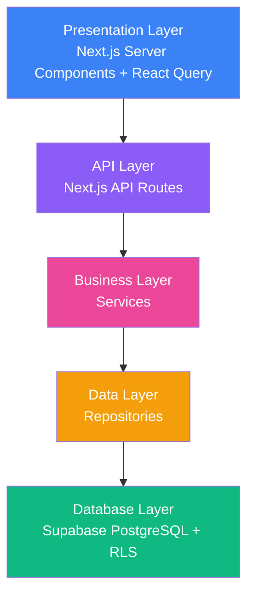

# Architecture Overview

TamborraData follows a **clean, layered architecture** with strict separation of concerns. The application is organized into distinct layers, each with a single responsibility, making it maintainable, testable, and scalable.

## Architecture Diagram



## Layered Architecture

The application is organized into five distinct layers:

<AccordionGroup>
  <Accordion title="1. Presentation Layer" icon="desktop">
    **Location:** `app/(frontend)/`
    
    **Responsibilities:**
    - Rendering UI components
    - Client-side interactivity
    - Data fetching with React Query
    - Server Components for SEO and performance
    
    **Technologies:**
    - Next.js 16 App Router
    - React Server Components
    - TanStack React Query
    - TailwindCSS
    
    **Example structure:**
    ```
    app/(frontend)/
    ├── statistics/
    │   ├── page.tsx              # Server Component
    │   ├── components/           # Feature components
    │   ├── hooks/                # React Query hooks
    │   └── services/             # HTTP calls
    ```
  </Accordion>

  <Accordion title="2. API Layer" icon="code">
    **Location:** `app/(backend)/api/`
    
    **Responsibilities:**
    - HTTP request handling
    - Request/response validation
    - Error handling
    - Query parameter parsing
    
    **Pattern:** Each API route follows this structure:
    ```
    api/[feature]/
    ├── route.ts              # HTTP handler
    ├── dtos/                 # Validation schemas
    ├── services/             # Business logic
    ├── repositories/         # Data access
    └── types/                # TypeScript types
    ```
    
    **Example:** `app/(backend)/api/statistics/route.ts:7`
  </Accordion>

  <Accordion title="3. Business Layer" icon="brain">
    **Location:** `app/(backend)/api/*/services/`
    
    **Responsibilities:**
    - Business logic implementation
    - Data transformation and formatting
    - Orchestrating repository calls
    - Error handling and logging
    
    **Example:** `app/(backend)/api/statistics/services/statistics.service.ts:7`
    
    Services contain NO database queries, only business logic.
  </Accordion>

  <Accordion title="4. Data Layer" icon="database">
    **Location:** `app/(backend)/api/*/repositories/`
    
    **Responsibilities:**
    - Database queries
    - Data access abstraction
    - SQL/ORM operations
    - Connection management
    
    **Example:** `app/(backend)/api/statistics/repositories/statistics.repo.ts:6`
    
    Repositories contain ONLY data access code, no business logic.
  </Accordion>

  <Accordion title="5. Database Layer" icon="server">
    **Location:** Supabase PostgreSQL
    
    **Responsibilities:**
    - Data persistence
    - Row Level Security (RLS)
    - Constraints and indexes
    - Triggers and functions
    
    **Configuration:** `app/(backend)/core/db/supabaseClient.ts:6`
  </Accordion>
</AccordionGroup>

## Request Flow Example

Here's how a typical request flows through the layers:

<Steps>
  <Step title="User Interaction">
    User visits `/statistics/2024` page
  </Step>
  
  <Step title="Presentation Layer">
    Server Component renders, React Query hook calls service
    ```typescript
    // app/(frontend)/hooks/query/useStatisticsQuery.ts
    const { data } = useStatisticsQuery('2024');
    ```
  </Step>
  
  <Step title="HTTP Request">
    Service makes HTTP request to API route
    ```typescript
    // app/(frontend)/services/fetchStatistics.ts
    fetch('/api/statistics?year=2024')
    ```
  </Step>
  
  <Step title="API Layer">
    Route handler validates parameters and calls service
    ```typescript
    // app/(backend)/api/statistics/route.ts
    const { valid, cleanYear } = await checkParams(year);
    const { statistics } = await getStatistics(cleanYear);
    ```
  </Step>
  
  <Step title="Business Layer">
    Service processes data and calls repository
    ```typescript
    // services/statistics.service.ts
    const { statistics } = await fetchStatistics(year);
    const grouped = groupBy(statistics, 'category');
    ```
  </Step>
  
  <Step title="Data Layer">
    Repository executes database query
    ```typescript
    // repositories/statistics.repo.ts
    await supabaseClient
      .from('statistics')
      .select('*')
      .eq('year', year);
    ```
  </Step>
  
  <Step title="Database Layer">
    PostgreSQL executes query with RLS policies applied
  </Step>
  
  <Step title="Response">
    Data flows back up through all layers to the UI
  </Step>
</Steps>

## Design Principles

<CardGroup cols={2}>
  <Card title="Separation of Concerns" icon="layer-group">
    Each layer has a single, well-defined responsibility. UI code doesn't touch databases, repositories don't handle HTTP.
  </Card>
  
  <Card title="Dependency Direction" icon="arrow-down">
    Dependencies flow downward only. Upper layers depend on lower layers, never the reverse.
  </Card>
  
  <Card title="Abstraction" icon="cube">
    Each layer abstracts implementation details. Services don't know if data comes from PostgreSQL, MongoDB, or REST API.
  </Card>
  
  <Card title="Testability" icon="vial">
    Each layer can be tested independently by mocking the layer below it.
  </Card>
</CardGroup>

## Benefits of This Architecture

<AccordionGroup>
  <Accordion title="Maintainability" icon="wrench">
    - Clear organization makes code easy to find
    - Changes in one layer don't affect others
    - New features follow established patterns
    - Code reviews are more focused
  </Accordion>

  <Accordion title="Testability" icon="flask">
    - Mock repositories for service tests
    - Mock services for API route tests
    - Integration tests at layer boundaries
    - Unit tests within each layer
  </Accordion>

  <Accordion title="Scalability" icon="arrow-up-right-dots">
    - Easy to add new features
    - Repositories can be optimized independently
    - Services can be extracted to microservices if needed
    - Caching can be added at any layer
  </Accordion>

  <Accordion title="Security" icon="shield">
    - Database security enforced by RLS
    - Input validation at API layer
    - Business rules in service layer
    - No SQL injection risk with proper abstraction
  </Accordion>
</AccordionGroup>

## Project Structure

The codebase is organized by feature, not by file type:

<CodeGroup>
```bash ✅ Good: Feature-based
app/
├── (frontend)/              # Presentation Layer
│   ├── statistics/
│   │   ├── page.tsx
│   │   ├── components/
│   │   ├── hooks/
│   │   └── services/
│   └── search/
│       ├── page.tsx
│       ├── components/
│       └── hooks/
└── (backend)/               # API + Business + Data Layers
    ├── api/
    │   ├── statistics/
    │   │   ├── route.ts     # API Layer
    │   │   ├── services/    # Business Layer
    │   │   ├── repositories/# Data Layer
    │   │   ├── dtos/
    │   │   └── types/
    │   └── participants/
    │       ├── route.ts
    │       ├── services/
    │       └── repositories/
    ├── core/
    │   └── db/              # Database client
    └── shared/
        └── utils/           # Shared utilities
```

```bash ❌ Bad: Type-based
app/
├── components/
│   ├── StatisticsTable.tsx
│   ├── ParticipantSearch.tsx
│   └── YearSelector.tsx
├── services/
│   ├── statisticsService.ts
│   └── participantsService.ts
└── repositories/
    ├── statisticsRepo.ts
    └── participantsRepo.ts
```
</CodeGroup>

<Note>
  **Feature-based organization** makes it easy to:
  - Find all code related to a feature
  - Delete or refactor features without affecting others
  - Understand the scope of changes
  - Reduce merge conflicts
</Note>

## Code Organization Rules

<Warning>
  **Important conventions:**
  
  1. **Server-only code** must have `import 'server-only'` at the top
  2. **Client Components** must have `'use client'` directive
  3. **Repositories** never contain business logic
  4. **Services** never contain SQL queries
  5. **Routes** only handle HTTP concerns
</Warning>

## Comparison with Alternatives

| Approach | TamborraData | Monolithic | Microservices |
|----------|--------------|------------|---------------|
| **Complexity** | ✅ Moderate | ✅ Low | ❌ High |
| **Maintainability** | ✅ High | ❌ Low | ⚠️ Medium |
| **Performance** | ✅ Fast | ✅ Fast | ⚠️ Network overhead |
| **Testability** | ✅ Easy | ❌ Hard | ✅ Easy |
| **Scalability** | ✅ Good | ❌ Limited | ✅ Excellent |
| **Team Size** | ✅ Small-Medium | ✅ Small | ❌ Large |

<Info>
  **Why layered monolith?** TamborraData uses a **modular monolith** approach that provides most benefits of microservices without the operational complexity. This is ideal for small-to-medium applications with a small team.
</Info>

## Next Steps

Explore each layer in detail:

<CardGroup cols={3}>
  <Card title="Frontend" icon="react" href="./frontend">
    Server Components, React Query, and UI patterns
  </Card>
  
  <Card title="Backend" icon="server" href="./backend">
    API Routes, Services, and Repository pattern
  </Card>
  
  <Card title="Database" icon="database" href="./database">
    PostgreSQL schema, RLS policies, and Supabase
  </Card>
</CardGroup>

## References

- [Clean Architecture by Robert C. Martin](https://blog.cleancoder.com/uncle-bob/2012/08/13/the-clean-architecture.html)
- [Repository Pattern by Martin Fowler](https://martinfowler.com/eaaCatalog/repository.html)
- [Next.js App Router Documentation](https://nextjs.org/docs/app)
- [React Query Patterns](https://tkdodo.eu/blog/practical-react-query)