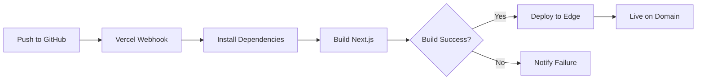

# Deployment Guide

This guide covers deploying TamborraData to production using Vercel, the recommended hosting platform for Next.js applications.

<Info>
  TamborraData is designed for **Vercel deployment** and takes advantage of Edge Functions, automatic scaling, and global CDN distribution.
</Info>

---

## Deployment Overview

### Why Vercel?

<CardGroup cols={2}>
  <Card title="Zero Configuration" icon="magic">
    Automatic Next.js detection and optimal build settings
  </Card>
  <Card title="Global CDN" icon="globe">
    Instant page loads from the nearest edge location
  </Card>
  <Card title="Automatic HTTPS" icon="lock">
    SSL certificates provisioned automatically
  </Card>
  <Card title="Preview Deployments" icon="eye">
    Every PR gets a unique preview URL
  </Card>
  <Card title="Analytics Built-in" icon="chart-line">
    Web Vitals and performance monitoring included
  </Card>
  <Card title="Serverless Functions" icon="bolt">
    API routes scale automatically
  </Card>
</CardGroup>

---

## Prerequisites

Before deploying, ensure you have:

<Steps>
  <Step title="GitHub Repository">
    TamborraData code pushed to a GitHub repository.
  </Step>
  
  <Step title="Vercel Account">
    Sign up at [vercel.com](https://vercel.com) (free tier available).
  </Step>
  
  <Step title="Supabase Production Database">
    A Supabase project configured with production data.
  </Step>
  
  <Step title="Domain (Optional)">
    Custom domain for production (or use Vercel's `.vercel.app` domain).
  </Step>
</Steps>

---

## Step 1: Prepare Your Repository

### Verify Build Locally

Before deploying, test the production build locally:

```bash
pnpm build
pnpm start
```

Visit [http://localhost:3000](http://localhost:3000) and verify:
- ✅ All pages load correctly
- ✅ No TypeScript errors
- ✅ No ESLint warnings
- ✅ Data fetches successfully
- ✅ Images and assets load

<Warning>
  Fix all errors before deploying. Vercel will fail deployment if the build fails.
</Warning>

### Required Files

Ensure these files exist in your repository:

```
├── package.json           # Dependencies and scripts
├── pnpm-lock.yaml         # Lock file for consistent installs
├── next.config.ts         # Next.js configuration
├── tsconfig.json          # TypeScript configuration
├── .gitignore             # Files to exclude from Git
└── app/                   # Next.js app directory
```

<Note>
  Vercel automatically detects `pnpm` if `pnpm-lock.yaml` is present.
</Note>

---

## Step 2: Set Up Production Database

### Create Production Supabase Project

<Steps>
  <Step title="Create new project">
    Go to [supabase.com](https://supabase.com) and create a new project:
    - **Name**: `tamborradata-production`
    - **Region**: Choose closest to your users
    - **Plan**: Free tier or Pro (depending on traffic)
  </Step>
  
  <Step title="Execute schema">
    In SQL Editor, run `mocked_data/tamborradata_schema.sql` to create tables.
  </Step>
  
  <Step title="Import production data">
    Import your real data (or mock data for initial deployment):
    - Use Table Editor to import CSVs
    - Or run SQL INSERT statements
    - Ensure `available_years` has correct years
  </Step>
  
  <Step title="Configure RLS">
    Verify Row Level Security is enabled:
    ```sql
    -- Check RLS is enabled
    SELECT tablename, rowsecurity 
    FROM pg_tables 
    WHERE schemaname = 'public';
    ```
    All tables should show `rowsecurity = true`.
  </Step>
  
  <Step title="Get production credentials">
    Go to Settings > API and copy:
    - **Project URL**
    - **anon key**
    
    Store these securely - you'll add them to Vercel.
  </Step>
</Steps>

<Warning>
  **Never commit production credentials** to Git. They should only exist in Vercel environment variables.
</Warning>

---

## Step 3: Deploy to Vercel

### Import Project

<Steps>
  <Step title="Connect GitHub">
    1. Go to [vercel.com/new](https://vercel.com/new)
    2. Click **Import Git Repository**
    3. Select your GitHub repository
    4. Authorize Vercel to access the repo
  </Step>
  
  <Step title="Configure Project">
    Vercel auto-detects settings:
    
    - **Framework Preset**: Next.js ✅
    - **Root Directory**: `./` (or `/source` if in monorepo)
    - **Build Command**: `pnpm build` (auto-detected)
    - **Output Directory**: `.next` (auto-detected)
    - **Install Command**: `pnpm install` (auto-detected)
    
    Leave defaults unless you have a custom setup.
  </Step>
  
  <Step title="Add Environment Variables">
    Click **Environment Variables** and add:
    
    | Name | Value |
    |------|-------|
    | `SUPABASE_URL` | Your production Supabase URL |
    | `SUPABASE_ANON_KEY` | Your production anon key |
    
    Select which environments:
    - ✅ **Production** (required)
    - ✅ **Preview** (recommended)
    - ⬜ **Development** (optional)
  </Step>
  
  <Step title="Deploy">
    Click **Deploy** and wait 1-2 minutes.
    
    Vercel will:
    1. Install dependencies with pnpm
    2. Run `pnpm build`
    3. Deploy to global edge network
    4. Assign a `.vercel.app` URL
  </Step>
</Steps>

<Check>
  **Success!** Your site is live at `https://your-project.vercel.app`
</Check>

---

## Step 4: Configure Custom Domain

### Add Domain to Vercel

<Steps>
  <Step title="Add domain">
    1. Go to Project Settings > Domains
    2. Enter your domain (e.g., `tamborradata.com`)
    3. Click **Add**
  </Step>
  
  <Step title="Configure DNS">
    Vercel provides DNS records to add at your registrar:
    
    **Option A: A Record (Recommended)**
    ```
    Type: A
    Name: @
    Value: 76.76.21.21
    ```
    
    **Option B: CNAME**
    ```
    Type: CNAME
    Name: @
    Value: cname.vercel-dns.com
    ```
    
    Add records at your domain registrar (GoDaddy, Namecheap, Cloudflare, etc.).
  </Step>
  
  <Step title="Add www subdomain (optional)">
    To support `www.tamborradata.com`:
    
    1. Add `www.tamborradata.com` in Vercel Domains
    2. Add CNAME record:
       ```
       Type: CNAME
       Name: www
       Value: cname.vercel-dns.com
       ```
    
    <Note>
      The `next.config.ts` redirect will automatically redirect www → non-www.
    </Note>
  </Step>
  
  <Step title="Wait for propagation">
    DNS changes take 5-60 minutes to propagate.
    
    Check status in Vercel Domains tab:
    - 🟡 **Pending**: DNS not propagated yet
    - 🟢 **Valid**: Domain configured correctly
  </Step>
  
  <Step title="SSL certificate">
    Vercel automatically provisions SSL certificates via Let's Encrypt.
    
    Once domain is valid, HTTPS is enabled automatically.
  </Step>
</Steps>

---

## Step 5: Configure Production Settings

### Vercel Project Settings

<AccordionGroup>
  <Accordion title="General Settings" icon="gear">
    **Project Name**: `tamborradata` (or your preferred name)
    
    **Build & Development Settings**:
    - Framework Preset: `Next.js`
    - Build Command: `pnpm build` (default)
    - Output Directory: `.next` (default)
    - Install Command: `pnpm install` (default)
    - Node Version: `18.x` (or `20.x`)
  </Accordion>
  
  <Accordion title="Environment Variables" icon="key">
    Ensure these are set for **Production**:
    
    ```bash
    SUPABASE_URL="https://xxx.supabase.co"
    SUPABASE_ANON_KEY="eyJ..."
    ```
    
    <Tip>
      Use different Supabase projects for Production vs Preview to avoid mixing test and real data.
    </Tip>
  </Accordion>
  
  <Accordion title="Git Integration" icon="code-branch">
    Configure automatic deployments:
    
    **Production Branch**: `main` (or `master`)
    - Commits to this branch deploy to production
    
    **Preview Branches**: All other branches
    - Every PR gets a unique preview URL
    - Great for testing before merging
  </Accordion>
  
  <Accordion title="Domains" icon="globe">
    **Production Domain**: `tamborradata.com`
    
    **Preview Domains**:
    - Branch previews: `branch-name.vercel.app`
    - PR previews: `pr-123.vercel.app`
  </Accordion>
</AccordionGroup>

---

## Step 6: Enable Analytics

TamborraData includes Vercel Analytics and Speed Insights.

### Web Analytics

<Steps>
  <Step title="Enable in Vercel">
    1. Go to Project > Analytics tab
    2. Click **Enable Analytics**
    3. Wait for first pageview
  </Step>
  
  <Step title="View metrics">
    Analytics show:
    - **Visitors**: Unique users
    - **Page Views**: Total views
    - **Top Pages**: Most visited routes
    - **Referrers**: Traffic sources
    - **Countries**: Geographic distribution
  </Step>
</Steps>

### Speed Insights

<Steps>
  <Step title="Enable Speed Insights">
    1. Go to Project > Speed Insights tab
    2. Click **Enable Speed Insights**
  </Step>
  
  <Step title="Monitor Web Vitals">
    Tracks:
    - **LCP**: Largest Contentful Paint
    - **FID**: First Input Delay
    - **CLS**: Cumulative Layout Shift
    - **TTFB**: Time to First Byte
  </Step>
</Steps>

<Note>
  Analytics are included in the Vercel Pro plan. Hobby (free) plan has limited analytics.
</Note>

---

## Deployment Workflow

### Continuous Deployment

Every Git push triggers a new deployment:



### Deployment Types

<CodeGroup>
```bash Production Deployment
# Merge to main branch
git checkout main
git merge feature-branch
git push origin main

# Result: Deploys to production domain
# https://tamborradata.com
```

```bash Preview Deployment
# Push to any non-main branch
git checkout feature-branch
git push origin feature-branch

# Result: Creates preview deployment
# https://feature-branch-tamborradata.vercel.app
```

```bash Manual Deployment
# Redeploy from Vercel dashboard
# Go to Deployments > Click "..." > Redeploy
```
</CodeGroup>

### Rollback

To rollback to a previous version:

<Steps>
  <Step title="Find deployment">
    Go to Deployments tab and find the working version.
  </Step>
  
  <Step title="Promote to production">
    Click **"..."** > **Promote to Production**.
  </Step>
  
  <Step title="Verify">
    Check production URL to confirm rollback.
  </Step>
</Steps>

<Tip>
  Vercel keeps all deployment history. You can rollback to any previous version instantly.
</Tip>

---

## Monitoring & Logs

### Real-time Logs

View logs in Vercel dashboard:

1. Go to Project > Deployments
2. Click on a deployment
3. View **Build Logs** and **Function Logs**

### Log Types

<AccordionGroup>
  <Accordion title="Build Logs" icon="hammer">
    Shows build process output:
    - Dependency installation
    - TypeScript compilation
    - Next.js build
    - Static page generation
    
    Check these if deployment fails.
  </Accordion>
  
  <Accordion title="Function Logs" icon="function">
    Runtime logs from API routes:
    - Request/response logs
    - Errors and exceptions
    - Console.log output
    - Performance metrics
    
    Use for debugging API issues.
  </Accordion>
  
  <Accordion title="Edge Logs" icon="globe">
    Logs from Edge Middleware:
    - Redirects
    - Rewrites  
    - Header modifications
    
    Available on Pro plan.
  </Accordion>
</AccordionGroup>

---

## Troubleshooting Deployment

### Build Failures

<AccordionGroup>
  <Accordion title="TypeScript Errors" icon="triangle-exclamation">
    **Error**: `Type error: ...`
    
    **Solution**:
    ```bash
    # Test locally first
    pnpm tsc --noEmit
    
    # Fix errors, then commit
    git add .
    git commit -m "fix: resolve type errors"
    git push
    ```
  </Accordion>
  
  <Accordion title="Missing Dependencies" icon="box">
    **Error**: `Module not found: Can't resolve '...'`
    
    **Solution**:
    ```bash
    # Ensure dependency is in package.json
    pnpm add <missing-package>
    
    # Commit lockfile
    git add package.json pnpm-lock.yaml
    git commit -m "fix: add missing dependency"
    git push
    ```
  </Accordion>
  
  <Accordion title="Environment Variable Missing" icon="key">
    **Error**: Database connection fails, blank pages
    
    **Solution**:
    1. Check Vercel Project Settings > Environment Variables
    2. Ensure `SUPABASE_URL` and `SUPABASE_ANON_KEY` are set
    3. Variables must be set for **Production** environment
    4. Redeploy after adding variables
  </Accordion>
  
  <Accordion title="Build Timeout" icon="clock">
    **Error**: `Build exceeded maximum duration`
    
    **Solutions**:
    - Remove unused dependencies
    - Optimize build process
    - Upgrade to Vercel Pro (longer timeout)
  </Accordion>
</AccordionGroup>

### Runtime Issues

<AccordionGroup>
  <Accordion title="API Routes Not Working" icon="code">
    **Problem**: `/api/*` returns 404 or 500
    
    **Solutions**:
    1. Check Function Logs for errors
    2. Verify Supabase credentials in environment variables
    3. Test API routes locally: `pnpm build && pnpm start`
    4. Check for CORS issues (not common with same-origin API)
  </Accordion>
  
  <Accordion title="Database Connection Errors" icon="database">
    **Problem**: `Error connecting to Supabase`
    
    **Solutions**:
    1. Verify `SUPABASE_URL` is correct
    2. Check `SUPABASE_ANON_KEY` is the anon key, not service_role
    3. Ensure Supabase project is not paused (free tier)
    4. Check RLS policies allow read access
  </Accordion>
  
  <Accordion title="Slow Performance" icon="gauge">
    **Problem**: Pages load slowly
    
    **Solutions**:
    1. Check Speed Insights for specific metrics
    2. Optimize images (use Next.js Image component)
    3. Enable React Query caching (already configured)
    4. Consider upgrading Supabase plan if database is slow
  </Accordion>
</AccordionGroup>

---

## Security Best Practices

<Warning>**Critical Security Checklist**</Warning>

<Steps>
  <Step title="Never commit secrets">
    - ❌ Don't commit `.env.local`
    - ❌ Don't commit `SUPABASE_ANON_KEY` in code
    - ✅ Use Vercel Environment Variables
  </Step>
  
  <Step title="Use anon key only">
    - ❌ Never use `service_role` key in frontend
    - ✅ Only use `anon` key for client connections
    - ✅ RLS policies enforce data access rules
  </Step>
  
  <Step title="Enable HTTPS only">
    - ✅ Vercel enforces HTTPS automatically
    - ✅ HSTS header configured in `next.config.ts`
  </Step>
  
  <Step title="Review RLS policies">
    - ✅ Ensure all tables have RLS enabled
    - ✅ Policies allow only necessary access
    - ✅ Test with anonymous user access
  </Step>
  
  <Step title="Keep dependencies updated">
    ```bash
    pnpm outdated
    pnpm update
    ```
    
    Regularly update to patch security vulnerabilities.
  </Step>
</Steps>

---

## Performance Optimization

### Next.js Optimizations (Already Configured)

<Check>
  TamborraData already implements these optimizations:
</Check>

- ✅ **Server Components**: Default rendering strategy
- ✅ **React Query Caching**: Reduces API calls
- ✅ **Image Optimization**: Next.js Image component
- ✅ **Code Splitting**: Automatic per-route
- ✅ **Compression**: gzip/brotli enabled
- ✅ **Edge Runtime**: API routes run on Edge

### Additional Optimizations

<Tip>
  Consider these for even better performance:
</Tip>

1. **Enable ISR (Incremental Static Regeneration)**
   ```typescript
   // In page component
   export const revalidate = 3600; // Revalidate every hour
   ```

2. **Add Static Generation for stable pages**
   ```typescript
   // For year pages that don't change
   export async function generateStaticParams() {
     return [{ year: '2024' }, { year: '2025' }];
   }
   ```

3. **Optimize Supabase queries**
   - Use `select()` to fetch only needed columns
   - Add indexes on frequently queried columns
   - Enable connection pooling

---

## Scaling Considerations

### Traffic Handling

Vercel automatically scales:
- **Edge Network**: Serves from 100+ global locations
- **Serverless Functions**: Scale to zero, scale to millions
- **No configuration needed**: Automatic load balancing

### Database Scaling

For high traffic, consider:

1. **Upgrade Supabase plan**: More connections and better performance
2. **Enable connection pooling**: Use Supabase's pooler
3. **Add database indexes**: Speed up queries
4. **Implement caching**: React Query + CDN caching

---

## Next Steps

<CardGroup cols={2}>
  <Card title="Monitor Performance" icon="chart-line">
    Set up alerts and monitoring in Vercel
  </Card>
  <Card title="Custom Domain Setup" icon="globe">
    Configure your production domain
  </Card>
  <Card title="CI/CD Pipeline" icon="rotate">
    Automate testing before deployment
  </Card>
  <Card title="Backup Strategy" icon="database">
    Set up automated Supabase backups
  </Card>
</CardGroup>

<Check>
  **Congratulations!** Your TamborraData instance is now live in production.
</Check>
