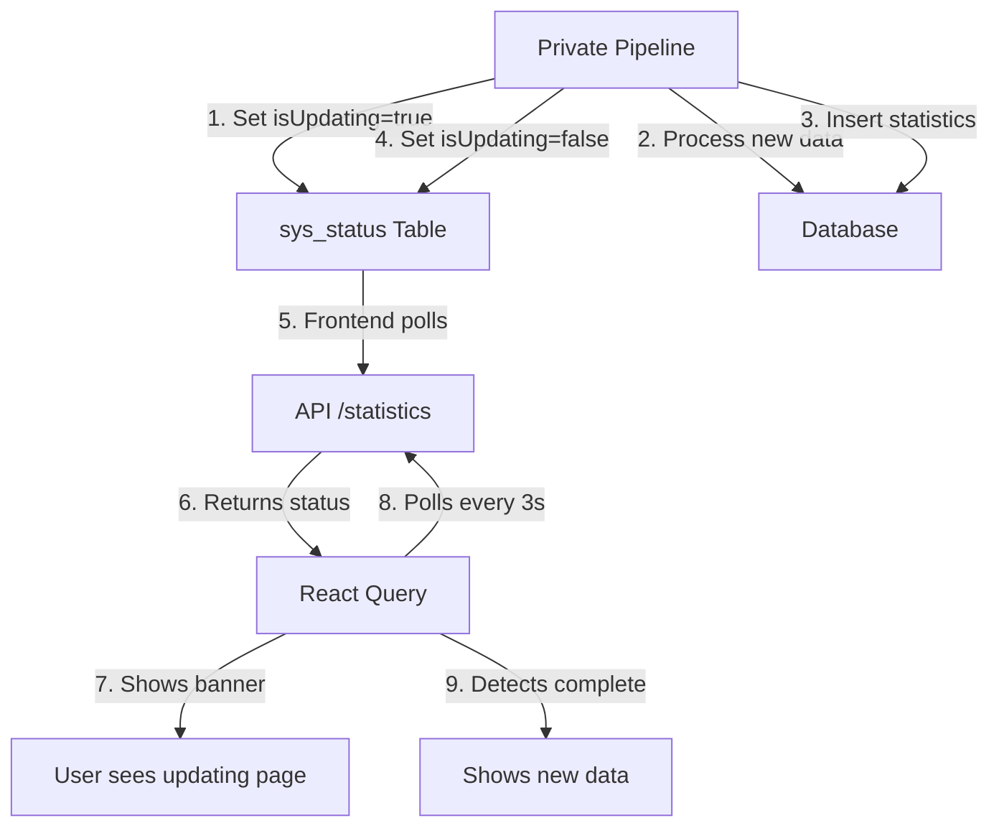

TamborraData features an **automatic annual update system** that detects when new data is being processed and shows a real-time updating banner to users. This happens every January without requiring downtime or manual intervention.

## Overview

The `isUpdating` system provides:

<CardGroup cols={2}>
  <Card title="Zero Downtime" icon="circle-check">
    Website stays online during data updates
  </Card>
  <Card title="Real-time Detection" icon="bell">
    Automatic polling detects when updates finish
  </Card>
  <Card title="User Feedback" icon="info-circle">
    Clear banner shows update status
  </Card>
  <Card title="Seamless Transition" icon="arrows-rotate">
    Smooth transition when new data is ready
  </Card>
</CardGroup>

## Architecture

### System Flow



### Components

<Tabs>
  <Tab title="Database">
    **sys_status Table**
    
    Single-row table that stores the update status:
    
    ```sql
    CREATE TABLE sys_status (
      id integer PRIMARY KEY DEFAULT 1,
      is_updating boolean DEFAULT FALSE NOT NULL,
      updated_at timestamptz DEFAULT now() NOT NULL,
      notes text
    );
    ```
    
    <Note>
    This is a **singleton table** - it only ever contains one row with `id = 1`.
    </Note>
  </Tab>
  
  <Tab title="Backend">
    **getSysStatus() Function**
    
    Checks the `sys_status` table and returns the current state:
    
    ```typescript
    export async function getSysStatus(): Promise<boolean | null> {
      const isDev = process.env.NODE_ENV === 'development';
      const now = new Date();
      const month = now.getMonth(); // 0 = January
      const day = now.getDate();

      // Only check during January or February ≤ 20
      if (isDev || month === 0 || (month === 1 && day <= 20)) {
        const { data, error } = await supabaseClient
          .from('sys_status')
          .select('is_updating')
          .eq('id', 1)
          .single();

        if (error || !data) return false;
        return data.is_updating as boolean;
      }

      // Outside January/February → always false
      return false;
    }
    ```
    
    <Info>
    **Date optimization**: The function only queries the database during January and early February. The rest of the year, it returns `false` without a database call.
    </Info>
  </Tab>
  
  <Tab title="Frontend">
    **React Query Polling**
    
    The frontend uses conditional polling to detect changes:
    
    ```typescript
    export function useStatisticsQuery<T>(year: string) {
      return useQuery({
        queryKey: queryKeys.statistics(year),
        queryFn: ({ signal }) => fetchStatistics<T>(year, signal),
        
        // Infinite cache for historical data
        staleTime: Infinity,
        gcTime: Infinity,
        
        // Conditional polling
        refetchInterval: (query) => {
          const isUpdating = query.state.data?.isUpdating;
          return isUpdating ? 3000 : false;  // Poll every 3s if updating
        },
        
        // Refetch on window focus if updating
        refetchOnWindowFocus: (query) => {
          return query.state.data?.isUpdating === true;
        }
      });
    }
    ```
  </Tab>
  
  <Tab title="Private Pipeline">
    **Automated Pipeline** (Private Repository)
    
    The private pipeline runs during January:
    
    ```python
    def update_tamborrada_data():
        # 1. Activate update mode
        supabase.table('sys_status').update({
            'is_updating': True,
            'updated_at': datetime.now()
        }).eq('id', 1).execute()

        try:
            # 2. Scrape official lists
            participants = scrape_official_lists()

            # 3. Clean and validate data
            clean_data = validate_and_clean(participants)

            # 4. Generate statistics
            statistics = generate_statistics(clean_data)

            # 5. Insert into database
            supabase.table('participants').insert(clean_data).execute()
            supabase.table('statistics').insert(statistics).execute()
            supabase.table('available_years').insert({
                'year': '2025',
                'is_ready': True
            }).execute()

            # 6. Deactivate update mode
            supabase.table('sys_status').update({
                'is_updating': False,
                'updated_at': datetime.now()
            }).eq('id', 1).execute()
            
        except Exception as e:
            # Rollback on error
            supabase.table('sys_status').update({
                'is_updating': False,
                'notes': f'Error: {str(e)}'
            }).eq('id', 1).execute()
            raise
    ```
    
    <Note>
    The private pipeline repository is **not public** because it processes sensitive information about minors (full names, schools).
    </Note>
  </Tab>
</Tabs>

## User Experience

### Updating Banner

When `isUpdating = true`, users see an updating page:

```tsx title="app/(frontend)/statistics/components/UpdatingPage.tsx"
'use client';
import { ExclamationIcon } from '@/app/(frontend)/icons/icons';

export function UpdatingPage() {
  return (
    <div className="w-full h-screen flex flex-col items-center justify-center gap-4">
      <ExclamationIcon />
      <h4 className="text-base md:text-xl font-bold text-center">
        La página se está actualizando...
      </h4>
      <p className="text-sm text-center text-(--color-text-secondary)">
        Visita la página dentro de un rato para ver las estadísticas actualizadas.
      </p>
    </div>
  );
}
```

**File location**: `app/(frontend)/statistics/components/UpdatingPage.tsx:5`

### Conditional Rendering

Components check the `isUpdating` status:

```tsx
export function StatisticsContent({ year }) {
  const { data, isLoading } = useStatisticsQuery(year);

  if (isLoading) return <LoadingPage />;
  
  if (data?.isUpdating) return <UpdatingPage />;
  
  return <StatisticsTable data={data.statistics} />;
}
```

## Complete Flow Example

### Scenario: User visits during update

1. **User navigates to** `/statistics/2025`
2. **Backend checks** `sys_status` table → `is_updating = true`
3. **API returns** `{ isUpdating: true }`
4. **Frontend receives** the status via React Query
5. **UI shows** updating banner
6. **Frontend activates** polling (every 3 seconds)
7. **3 seconds later**, frontend queries again
8. **Backend checks** `sys_status` → still `true`
9. **API returns** `{ isUpdating: true }` again
10. **User continues seeing** updating banner
11. **Meanwhile**, private pipeline finishes processing
12. **Pipeline updates** `sys_status` → `is_updating = false`
13. **Next poll (3s)**, frontend queries again
14. **Backend checks** `sys_status` → now `false`
15. **API returns** full statistics
16. **React Query updates** cache with new data
17. **UI transitions** to show new statistics
18. **Polling stops** automatically

<Tip>
Users don't need to refresh the page - the transition happens automatically when data is ready.
</Tip>

## API Response Format

### During Update

```json
{
  "isUpdating": true
}
```

### Normal Operation

```json
{
  "isUpdating": false,
  "year": "2024",
  "statistics": {
    "intro": [...],
    "top_names": [...],
    "top_surnames": [...],
    "top_schools": [...],
    // ... more categories
  }
}
```

## Backend Implementation

### API Route

```typescript title="app/(backend)/api/statistics/route.ts"
import { NextResponse } from 'next/server';
import { getSysStatus } from '@/app/(backend)/shared/utils/getSysStatus';
import { getStatistics } from './services/statistics.service';

export async function GET(req: Request) {
  const year = new URL(req.url).searchParams.get('year');

  // Check system status
  const isUpdating = await getSysStatus();

  // If updating, return minimal response
  if (isUpdating) {
    return NextResponse.json({ isUpdating: true }, { status: 200 });
  }

  // Normal case: return full statistics
  const statistics = await getStatistics(year);
  return NextResponse.json({
    isUpdating: false,
    year,
    statistics
  });
}
```

### Date Optimization

The system only checks the database during update season:

| Date Range | Behavior |
|------------|----------|
| January 1-31 | Query database on every request |
| February 1-20 | Query database on every request |
| Rest of year | Return `false` without DB query |

**Rationale**: Updates only happen in January. No need to query the database the rest of the year.

```typescript
if (isDev || month === 0 || (month === 1 && day <= 20)) {
  // Check database
} else {
  // Skip database query
  return false;
}
```

<Info>
This optimization **saves ~10,000 database reads per month** outside the update window.
</Info>

## Polling Behavior

### When Polling Activates

```typescript
refetchInterval: (query) => {
  const isUpdating = query.state.data?.isUpdating;
  return isUpdating ? 3000 : false;
}
```

| State | Action |
|-------|--------|
| `isUpdating = false` | No polling (infinite cache) |
| `isUpdating = true` | Poll every 3 seconds |
| User changes tab | If updating, refetch on return |
| User navigates away | Stop polling automatically |

### Window Focus Refetching

```typescript
refetchOnWindowFocus: (query) => {
  return query.state.data?.isUpdating === true;
}
```

If the user switches tabs during an update:

1. Polling **continues in background** (limited by browser)
2. When user returns, React Query **immediately refetches**
3. If update finished, user sees new data right away

## Error Handling

### Pipeline Failure

If the pipeline encounters an error:

```python
try:
    update_statistics()
except Exception as e:
    # Rollback: deactivate isUpdating
    supabase.table('sys_status').update({
        'is_updating': False,
        'notes': f'Error: {str(e)}'
    }).eq('id', 1).execute()
    raise
```

**Result**: `isUpdating` returns to `false`, and the frontend shows data from the previous year.

### Database Connection Issues

```typescript
export async function getSysStatus(): Promise<boolean | null> {
  try {
    const { data, error } = await supabaseClient
      .from('sys_status')
      .select('is_updating')
      .eq('id', 1)
      .single();

    if (error || !data) return false;
    return data.is_updating as boolean;
  } catch (error) {
    console.error('Error fetching sys_status:', error);
    return false;  // Fail open - show content
  }
}
```

**Fail-open strategy**: If the database is unreachable, assume `isUpdating = false` and show existing data.

## Performance Considerations

### Supabase Reads

| Scenario | Database Reads per Month |
|----------|-------------------------|
| January (updating) | ~10,000 reads |
| February 1-20 | ~3,000 reads |
| Rest of year | 0 reads (optimized) |

### React Query Deduplication

If multiple tabs are open:

- Each tab has its own React Query instance
- All tabs poll independently
- React Query **deduplicates requests** → only 1 HTTP call

```tsx
// Tab 1: useStatisticsQuery('2025')
// Tab 2: useStatisticsQuery('2025')
// Tab 3: useStatisticsQuery('2025')
// → Only 1 actual HTTP request to /api/statistics
```

## Row-Level Security

The `sys_status` table has read-only access for anonymous users:

```sql
-- Frontend can only read, not write
CREATE POLICY "Anon read access on sys_status"
ON sys_status
FOR SELECT
TO anon
USING (true);
```

<Note>
Only the **private pipeline** (with service role credentials) can update `is_updating`.
</Note>

## Testing Locally

To test the updating flow in development:

```bash
# 1. Connect to your Supabase database
psql postgres://your-db-url

# 2. Set isUpdating to true
UPDATE sys_status SET is_updating = true WHERE id = 1;

# 3. Visit http://localhost:3000/statistics/2024
# You should see the updating banner

# 4. After testing, reset to false
UPDATE sys_status SET is_updating = false WHERE id = 1;
```

## Why Not WebSockets?

Alternatives considered:

| Approach | Pros | Cons | Decision |
|----------|------|------|----------|
| **WebSockets** | Real-time, no polling | Complex, expensive, overkill | ❌ Not used |
| **Server-Sent Events** | Simpler than WebSockets | Not supported on Vercel Edge | ❌ Not used |
| **Polling (current)** | Simple, reliable, cheap | Slight delay (3s) | ✅ **Used** |
| **Manual refresh** | No overhead | Poor UX | ❌ Not used |

<Info>
**Polling is sufficient** because updates only happen once per year and the 3-second delay is acceptable.
</Info>

## Related Documentation

<CardGroup cols={2}>
  <Card title="React Query" icon="arrows-rotate" href="/advanced/react-query">
    Polling and caching configuration
  </Card>
  <Card title="Statistics Explorer" icon="magnifying-glass-chart" href="/features/statistics-explorer">
    How users browse statistics
  </Card>
  <Card title="Architecture" icon="diagram-project" href="/architecture/overview">
    System architecture overview
  </Card>
</CardGroup>